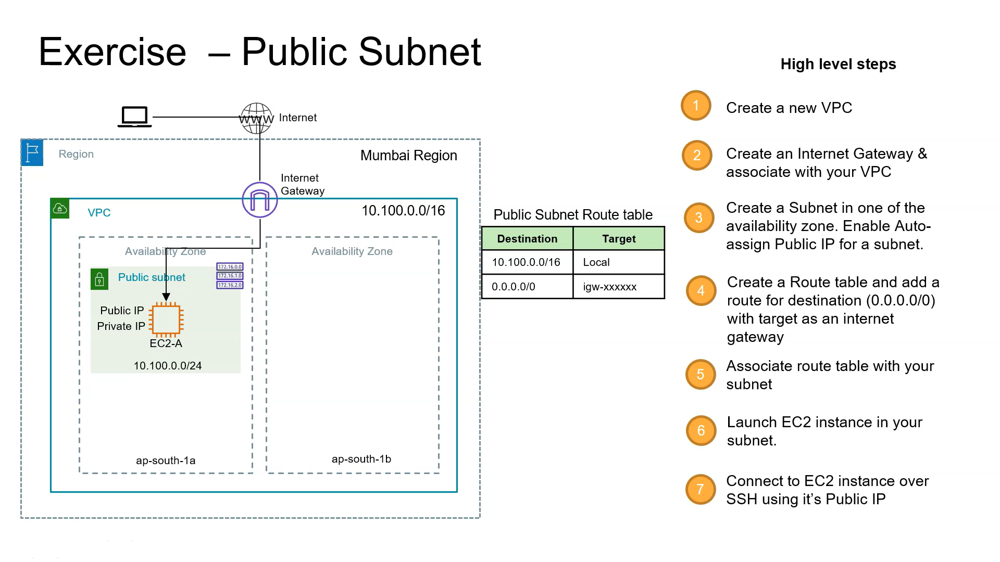
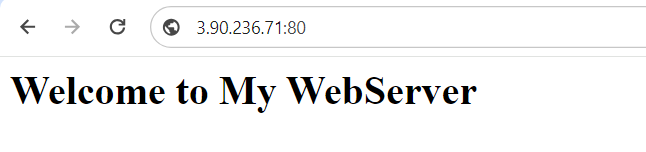

# Implementing The below Network Architecture using Terraform


### Implemented the above architecture successfully.

#### Steps to Follow after cloning the repository

create variables.tf file

```tf 
variable "AWS_CRED" {
  type = list(object({
    access_key = string
    secret_key = string
    token      = string
  }))
  default = [
    {
      access_key = "Paste_ACCESS_KEY"
      secret_key = "Paste_SECRET_KEY"
      //Most of the time token is not required if your having your own account
      token      = "Paste_TOKEN"
    }
  ]
  sensitive = true
} 
```
run the following commands one by one on your terminal

```tf
terraform init
terraform plan
terraform apply -auto-approve
```

Then test the connection to the EC2 instance using terminal.

```tf
ssh -i deployer-key.pem ec2-user@public_ip
```

To destroy,
```tf
terraform destroy -auto-approve
```

For More configurations can be done to the instance while launch itself using user_data

as of now we have created our webserver page which can accessed "public_ip:80"

